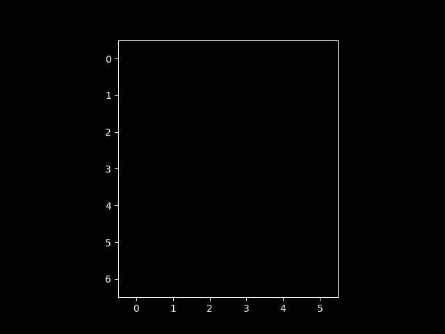

# Sokoban Playing RL Agent

Sokoban is a puzzle video game in which the player pushes boxes around in a warehouse, trying to get them to storage locations. The game was designed in 1981 by Hiroyuki Imabayashi, and first published in December 1982. 

The warehouse is depicted as a grid of squares, each one representing either a floor section or a wall section. Some floor squares contain boxes and some are marked as storage locations. The player, often represented as a worker character, can move one square at a time horizontally or vertically onto empty floor squares, but cannot pass through walls or boxes.
To move a box, the player walks up to it and pushes it to the square beyond. Boxes cannot be pushed to squares with walls or other boxes, and they cannot be pulled. The number of boxes equals the number of storage locations. The puzzle is solved when all boxes are located on storage locations.

I have implemented a simplified verison of the game and tried to teach an RL agent to play it.

I have implemented the following RL Algorithms:
1. On-Policy TD Control (SARSA)
2. Off-Policy TD Control (Q-Learning)
3. Off-Policy Monte Carlo
4. On-Policy Monte Carlo

`Warehouse_Env.py` contains the code for the custom environment
`Agent.py` contains the implementations of all the algorithms

This is a example of the output of our Q-Learning algorithm,  
  

Here, the yellow is our agent, red is our box and green is our goal.